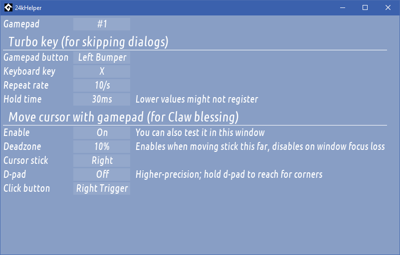

# Gamepad helper for 24 Killers

This is a little tool that aims to make subsequent playthroughs of
[24 Killers](https://store.steampowered.com/app/1668310/24_Killers/)
more enjoyable on a gamepad. It currently does two things:

- Adds a "turbo button" for skipping through dialogs/etc. quicker.
- Enables to do mouse input with a gamepad for the Claw blessing.  
  If you are unfamiliar, Claw allows you to grab and move Home with a mouse.  
  The tool translates 

## Building

Open the project file in [GameMaker](https://gamemaker.io) and compile for Windows.

If you'd like to compile everything from scratch, the extensions are:
- [display_mouse_sim](https://github.com/YAL-GameMaker/display_mouse_sim)
- [gamepad_force_focus](https://yellowafterlife.itch.io/gamemaker-gamepad-force-focus)
- [dinput8hook](https://github.com/nkrapivin/dinput8hook)
- window_get_active_title (in subdirectory)